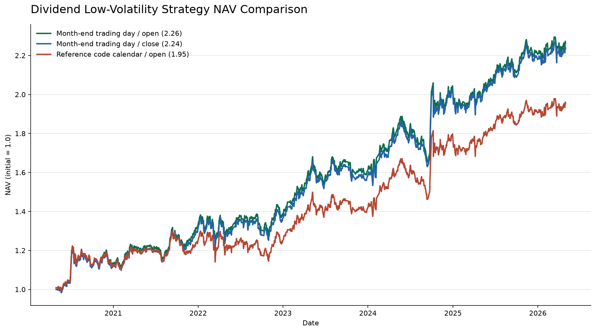

# 红利低波策略本地复现

本项目将聚宽版红利低波增强策略迁移到本地数据环境，提供点时可见（PIT）的选股因子、日频回测、复权与分红检查、交易约束审计以及净值报告。

> 本仓库用于研究复现，不构成投资建议。回测仍采用零滑点，不能直接视为实盘可实现收益。



## 当前结果

主口径为：2020-04-30 至 2026-04-30、4/8/10/12 月最后交易日调仓、前一交易日生成信号、开盘价近似 09:31 成交、`original_report` 财务口径、初始资金 100 万元。

| 指标 | 开盘成交 | 收盘成交敏感性 |
|---|---:|---:|
| 总收益 | 124.56% | 123.65% |
| 年化收益 | 15.05% | 14.97% |
| 年化波动 | 14.18% | 14.18% |
| 最大回撤 | -12.45% | -12.38% |
| 累计费用率 | 1.94% | 1.94% |

参考代码的日期判断只会在自然月最后一天恰好是交易日时触发。严格复现该条件只有 17 次调仓，总收益为 93.69%；项目主口径采用策略文字声明的“目标月份最后交易日”，共 25 次调仓。详细归因见 [回测报告](docs/backtest_report.md)。

## 关键口径

- 收益使用库内官方 `dwd_quant_adj_factor_eod_1day_di` 复权因子。
- 复权收益公式为 `close_t * factor_t / (close_{t-1} * factor_{t-1}) - 1`。
- 分母使用上一实际交易日原始收盘价，不使用除权日已调整的 `prev_close`。
- 持仓权重随每日收益自然漂移，不进行免费日度再平衡。
- 停牌、零成交、涨跌停受阻和 ST 过滤后保留现金，不放大其余目标权重。
- 交易费用包含佣金、卖出印花税和每笔最低 5 元佣金。
- 分红因子要求 `info_pub_date <= signal_date`，避免使用未来公告。
- 持仓收益缺失或复权单日收益绝对值超过 100% 时立即报错。

## 项目结构

```text
src/hldb/           数据访问、因子和回测核心
scripts/            数据检查、选股、回测和绘图入口
tests/              复权与账户核算回归测试
docs/               数据字典、回测报告和风险审计
data/cache/         本地 Parquet 缓存（不提交 Git）
reference/          原始聚宽策略和研究材料
reports/            可提交的净值图与汇总曲线
outputs/            本地完整回测输出（不提交 Git）
```

## 环境安装

需要 Python 3.12。推荐使用 Conda：

```bash
git clone https://github.com/Avery-Xv/hldb_research.git
cd hldb_research
bash scripts/setup_hldb_env.sh
conda activate hldb
```

也可以手动创建环境：

```bash
conda env create -f environment.yml
conda activate hldb
python -m pip install -e .
```

## 数据准备

大型 Parquet 缓存不会提交到 Git。运行前需要在 `data/cache/` 放置所需文件，完整文件名、来源表和用途见 [缓存说明](data/cache/README.md)。核心文件包括：

- `stock_daily_2014.parquet`
- `adj_factor_2015.parquet`
- `daily_basic_2015.parquet`
- `dividend_jydb_2013.parquet`
- 财务、交易日历、涨跌停、停牌和股票池缓存

先执行数据检查：

```bash
python scripts/check_data_portal.py
python scripts/validate_data_quality.py
python scripts/check_dividend_adjustment.py
```

## 运行回测

```bash
python scripts/run_backtest.py \
  --start 2020-04-30 \
  --end 2026-04-30 \
  --financial-mode original_report \
  --trade-at open \
  --initial-capital 1000000 \
  --min-commission 5 \
  --output-dir outputs/backtest_hldb_2020
```

输出包括：

- `metrics.csv`：收益和风险指标
- `nav.csv`：每日净值
- `trades.csv`：调仓、换手、费用和受阻统计
- `holdings.parquet`：每日持仓权重

生成净值对比图：

```bash
python scripts/plot_nav_comparison.py
```

绘图脚本读取已完成的三套对照回测，生成 `reports/nav_comparison.png` 和 `reports/nav_comparison.csv`。

## 测试

```bash
pytest -q
```

测试覆盖官方复权因子、除权日双重复权防护、缺失收益、权重漂移、异常收益、调仓阈值、现金保留和零成交过滤。

## 已知限制

- 参考策略在 09:31 下单，并于 14:00 检查昨日涨停股是否开板；当前历史缓存缺少匹配的一分钟行情，只能用日线开盘/收盘做敏感性分析。
- 当前滑点为 0，与参考代码一致，但偏理想化。实盘评估应至少增加 5bp、10bp、20bp 单边滑点情景。
- 不同数据源的财务修订版本和分红字段可能造成选股差异，迁移到新数据源时应重新执行 PIT 和单位检查。

## 延伸文档

- [回测报告](docs/backtest_report.md)
- [风险审计](docs/risk_audit.md)
- [数据字典](docs/data_dictionary.md)
- [因子实现](docs/factors.md)
- [数据质量报告](docs/data_quality_report.md)
